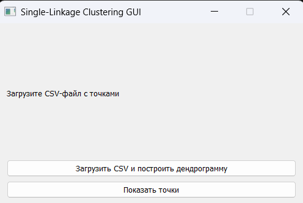
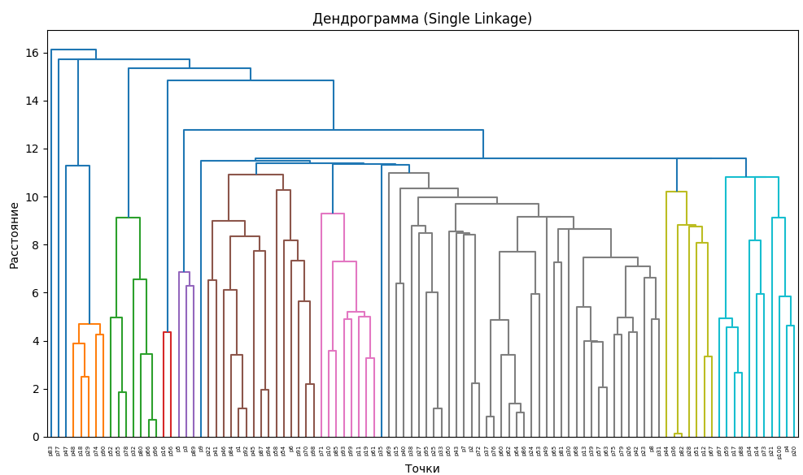

# 🧩 Agglomerative Clustering GUI (Single-Linkage)

Приложение с графическим интерфейсом, реализующее аггломеративную кластеризацию методом **Single Linkage (SLINK)**. Алгоритм реализован на C++ и подключается как `.dll`-библиотека. Интерфейс построен на **PyQt5**, визуализация кластеров выполнена с помощью **matplotlib** и **scipy**.

---

## 🚀 Возможности

- Загрузка пользовательских данных в формате `.csv`
- Кластеризация методом аггломерации с single-linkage
- Визуализация результатов:
  - дендрограмма кластеризации
  - диаграмма рассеяния с подписями и цветовой маркировкой
- Сборка всего приложения в `.exe`

---

## 📷 Интерфейс




---

## 📁 Структура проекта

```
project/
├── main.py                # основной GUI
├── slink_interface.py     # обёртка Python ↔ C++
├── slink.cpp              # алгоритм SLINK на C++
├── slink.dll              # собранная DLL-библиотека
├── dist/                  # итоговый .exe после сборки
├── result.csv             # результаты кластеризации
├── *.csv                  # входные наборы данных
└── README.md              # текущий файл
```

## 📈 Результаты кластеризации




---

## 📥 Формат входного файла

Файл `.csv` должен содержать два столбца:

```csv
12.4,5.7
6.3,8.2
...
```

---

## 🛠️ Зависимости (Python)

- Python 3.9+
- PyQt5
- numpy
- pandas
- matplotlib
- scipy

Установить всё сразу:
```bash
pip install -r requirements.txt
```

---

## 🧠 Алгоритм SLINK

Метод реализует пошаговое объединение кластеров на основе **минимального расстояния между точками разных кластеров**.

- Структура и расстояния рассчитываются на C++
- DLL экспортирует `void slink(Point* points, int n, int* labels)`
- Возвращается массив меток кластеров

---

## 🔍 Пример вывода

```bash
[LOG] Файл загружен: input.csv
[LOG] Кластеризация завершена. Результат сохранён в result.csv
```

---

## 📜 Лицензия

MIT License — свободное использование и модификация.

---

## 🤝 Авторы

- C++ реализация SLINK — *[твое имя / ник]*
- GUI на Python — *[твое имя / ник]*
- Документация и сборка — *[твое имя / ник]*

---
